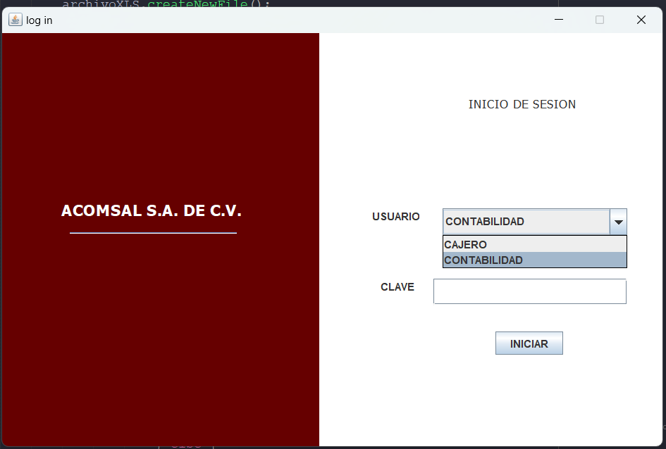
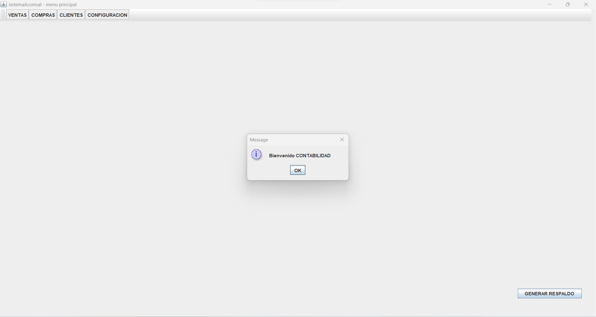
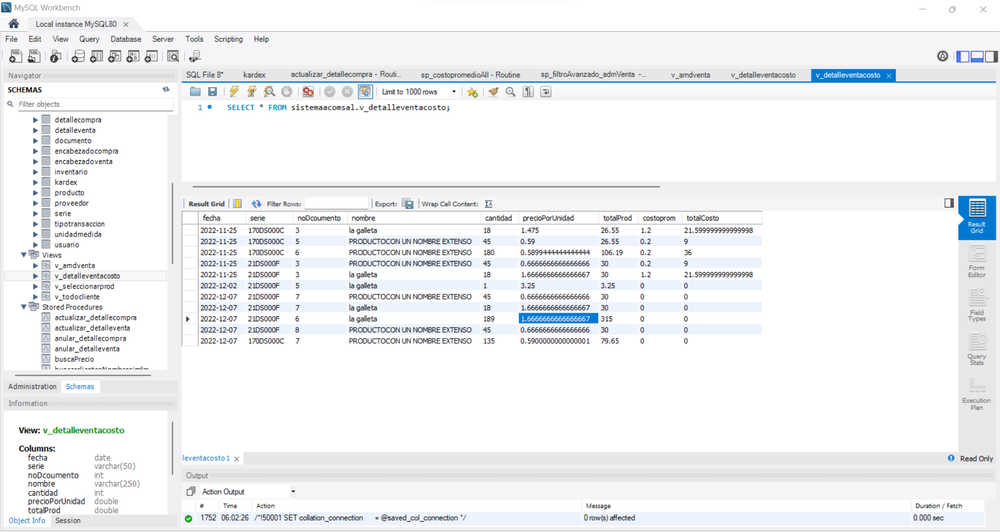

Aplicación: Sistema de facturacion e inventario  
1-	Objetivos del software:  
Crear un software funcional y robusto que demuestre las habilidades y conocimientos técnicos del desarrollador en el desarrollo de aplicaciones Java para la gestión de negocios. 
2-	Análisis de mercado  
No aplica, la aplicación es para practica con el objetivo de mostrar habilidades y conocimiento técnico en el uso de herramientas y aplicación de técnicas de programación para la producción de software.  
3-	Definición de alcance  
a.	Generación de facturas y comprobantes de crédito fiscal. 
b.	Actualización automática del inventario en la base de datos al facturar. 
c.	Actualización del inventario: disminución de stock de productos vendidos. 
d.	Consulta de inventario: disponibilidad de productos y niveles de stock actualizados, al momento de seleccionar un item de la factura
e.	Acceso seguro al sistema mediante autenticación de usuarios. 
f.	Diseño intuitivo y fácil de usar para la captura de datos y la visualización de información. 
g.	Utilización de una base de datos relacional para el almacenamiento de datos (MYSQL) 
h.	Diseño de tablas para almacenar información sobre clientes, productos, facturas e inventario, incluye el uso de store procedures, triggers, views, etc. 
i.	Rendimiento: respuesta rápida del sistema durante la generación de facturas y consultas de inventario. 
j.	Escalabilidad: capacidad para manejar un volumen creciente de datos y usuarios. 
k.	Disponibilidad: garantizar que el sistema esté disponible en todo momento, con mínimos tiempos de inactividad. 
l.	Generación de reportes en pantalla y en Excel: total de caja resumido, detalle de ventas con costo.  
m.	Edición de facturas, actualización, anulación y eliminación (tomado en cuenta con el stock de los productos para su actualización constante trayendo la lógica del negocio desde la bd) 

4-	Interfaz de usuario  
 Login:
 
 Bienvenida:
 
 Facturador de factura de consumidor final:
 
 Facturador de factura de credito fiscal:
 
 Selecccion del cliente: (Opcion similar para seleccionar productos)
 
 Opciones de descarga:
 
 
 Edicion de Facturas: 
 

 Administrador de ventas:
 
 Reportes:
 
 
 
 Pantalla de configuracion para especificar las series de los documentos y configurar el ancho de la impresion de la factura: 
 
 Funcion de respaldo de bd: 
 

 Sobre la base de datos: 
 Resumen: 
 
 Vistas: 
 

 Logica: 
 

  Disparadores: 
 

Diagrama ER: 
 

5-	Recopilación de requerimientos técnicos  
-	Entorno de Desarrollo: Netbeans, jdk 11 
-	Base de datos: MYSQL, MySQL Workbench, phpmyadmin. 
-	Lenguaje de programación: java, uso de la librería swing  

